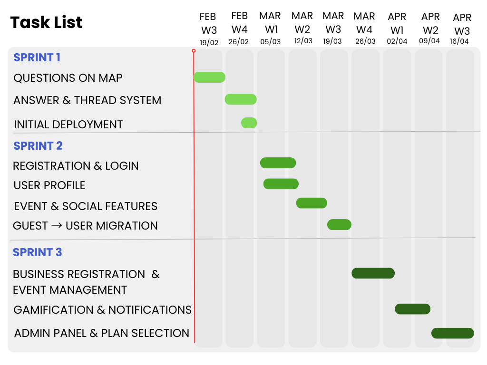

# Gantt Diagram

## Overview

This Gantt diagram visualizes the project timeline and task distribution across the three main development sprints. The diagram is based on the [Work Plan](../WORK_PLAN.md) and provides a clear view of milestone dependencies, task scheduling, and sprint deliverables.

## Gantt Chart Visualization

## Project Timeline

**Total Duration:** February 19 – April 16, 2026  
**Number of Sprints:** 3  
**Development Approach:** Incremental delivery with increasing feature complexity

---

## Sprint 1 — Core Q&A
**Duration:** Feb 19 – Mar 5 (2 weeks)

**Objective:** Establish the core Q&A functionality without user registration.

### Tasks and Timeline

| Task | User Stories | Start Date | End Date | Duration |
|------|--------------|------------|----------|----------|
| Questions on Map | US-08, US-11 | Feb 19 | Feb 26 | 1 week |
| Answer & Thread System | US-09, US-13 | Feb 26 | Mar 5 | 1 week |
| Initial Deployment | - | Mar 3 | Mar 5 | 3 days |

**Deliverable:** Users can ask and answer questions immediately without registration.

---

## Sprint 2 — Identity & Social
**Duration:** Mar 6 – Mar 26 (3 weeks)

**Objective:** Implement user identity management and social interaction features.

### Tasks and Timeline

| Task | User Stories | Start Date | End Date | Duration |
|------|--------------|------------|----------|----------|
| Registration & Login | US-01, US-03 | Mar 6 | Mar 13 | 1 week |
| User Profile | US-06 | Mar 6 | Mar 13 | 1 week |
| Event & Social Features | US-10, US-15, US-16 | Mar 13 | Mar 20 | 1 week |
| Guest → User Migration | - | Mar 20 | Mar 26 | 1 week |

**Deliverable:** Registered users with profiles and social interaction capabilities.

---

## Sprint 3 — Business & Gamification
**Duration:** Mar 27 – Apr 16 (3 weeks)

**Objective:** Complete the business ecosystem and implement engagement mechanisms.

### Tasks and Timeline

| Task | User Stories | Start Date | End Date | Duration |
|------|--------------|------------|----------|----------|
| Business Registration & Event Management | US-28, US-29, US-30 | Mar 27 | Apr 3 | 1 week |
| Gamification & Notifications | US-35, US-23, US-12 | Apr 3 | Apr 10 | 1 week |
| Admin Panel & Plan Selection | US-37, US-02 | Apr 10 | Apr 16 | 1 week |

**Deliverable:** Complete MVP with users, businesses, and reward systems.

---

## Key Milestones

1. **Week 2 (Mar 5):** Core Q&A functionality live
2. **Week 5 (Mar 26):** User registration and social features complete
3. **Week 8 (Apr 16):** Full MVP with business features and gamification

## Dependencies

- Sprint 2 depends on Sprint 1's Q&A foundation
- Guest-to-user migration requires both Q&A and registration systems
- Sprint 3's business features build upon the user identity system from Sprint 2
- Gamification requires existing user and business infrastructure

## Notes

- Some tasks within the same sprint run in parallel (e.g., Registration & User Profile in Sprint 2)
- Deployment activities overlap with final development tasks to ensure smooth releases
- The timeline allows for iterative testing and refinement between sprints
