# Mockups

## Description
This document contains the visual prototypes for the user interface of our application. Mockups serve as a blueprint for the design and user experience, helping the team visualize the layout, structure, and interaction flows before development begins.

## User Stories
### Critical Stories for MVP - Must Have

## **US-01: User registration**

## **US-02: Choose subscription plan**

## **US-03: Login**

## **US-04: Edit profile**

## **US-05: Delete account**

## **US-06: Basic user profile**

## **US-07: See Transactions**

## **US-08: Create question**

## **US-09: Answer questions**

## **US-10: Rate answers**

## **US-11: View active questions near me**

## **US-12: Notification or update of questions in my area**
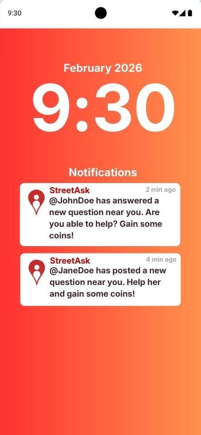

## **US-13: Question expiration**

## **US-14: View question details and thread**

### Important Stories for MVP - Should Have

## **US-15: Create my events**

## **US-16: Edit my events**

## **US-17: See my events**

## **US-18: Delete my events**

## **US-19: See Asistance**
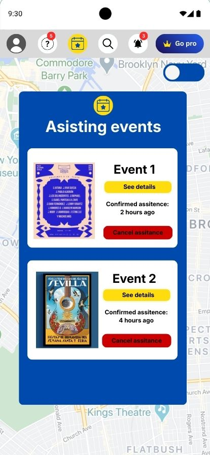

## **US-20: Event chat**

## **US-21: View event map**
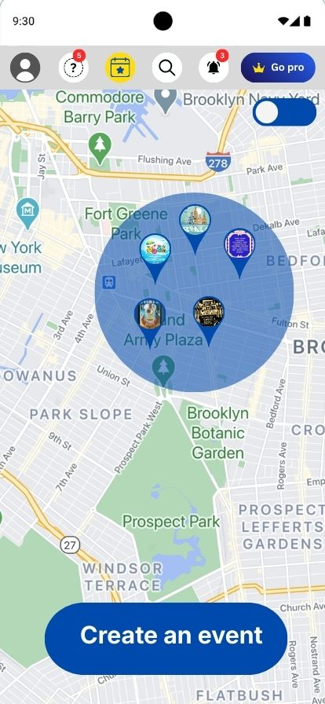

## **US-22: Auto-create event from question density**

## **US-23: View event details**
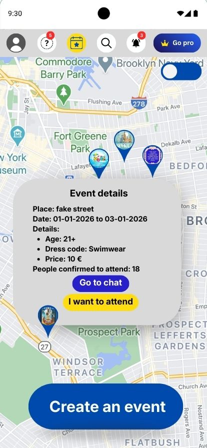

## **US-24: List of nearby events**

## **US-25: Map toggle**

## **US-26: Event search**
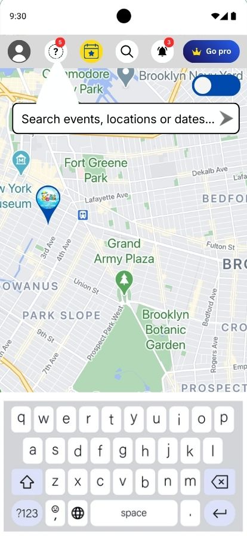

## **US-27: Post question about event**
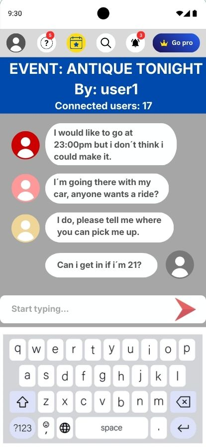

## **US-28: Earn coins for verified answer**
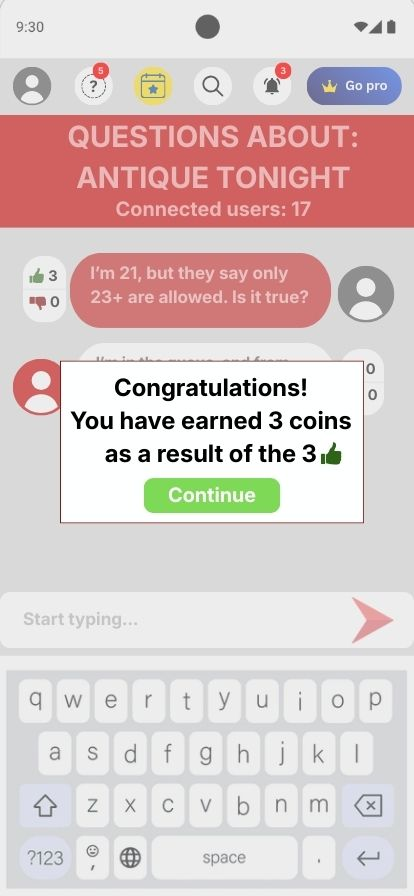

## **US-29: View coin balance**
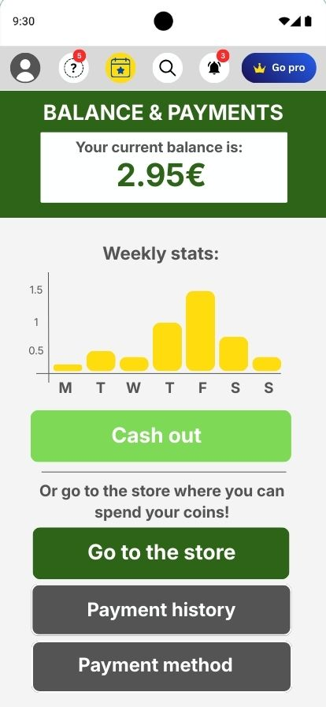

## **US-30: Business account registration**

## **US-31: Create sponsored event**
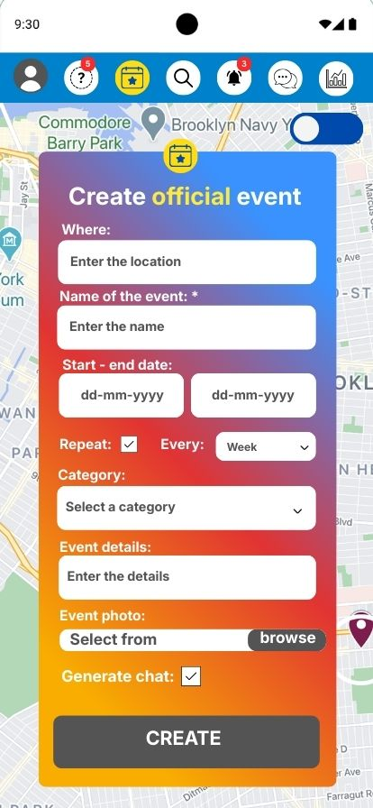

## **US-32: Admin panel**

## **US-33: Moderate inappropriate content**
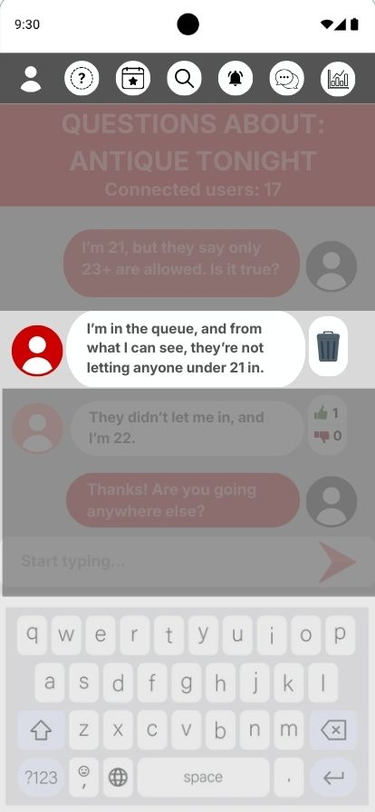

## **US-34: Verify business accounts**

## **US-35: Filter events by category**
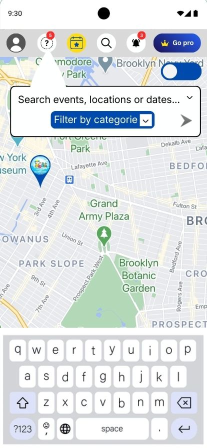

## **US-36: Notification of nearby events**
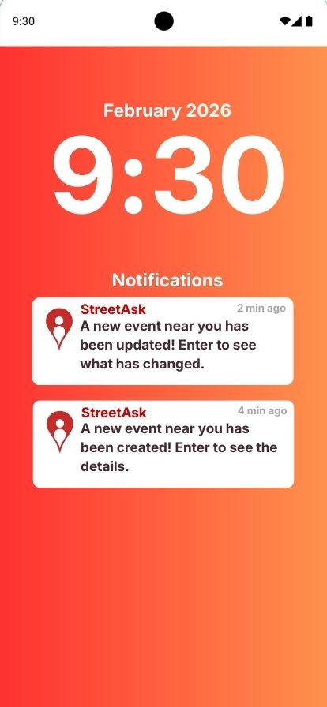

## **US-37: Basic rewards store**
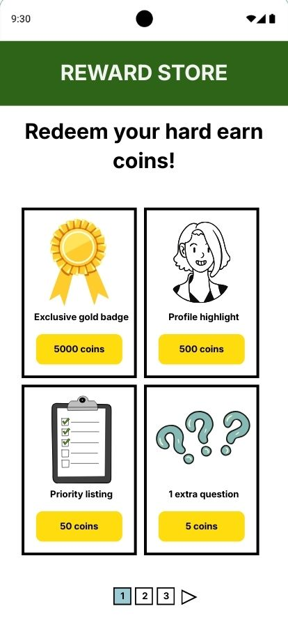

## **US-38: Rewards history**

## **US-39: Mark attendance to event**
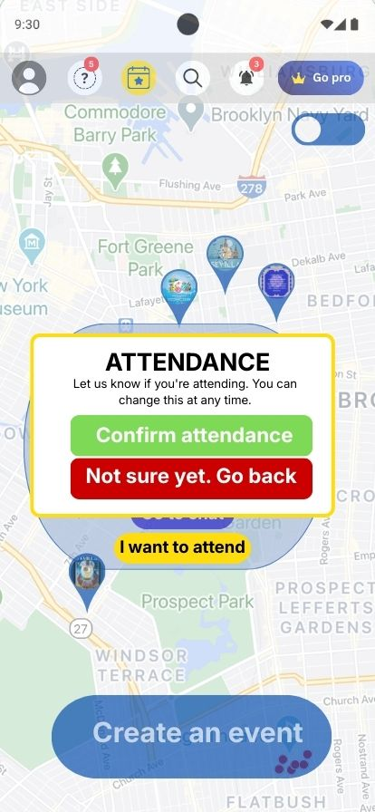

## **US-40: Report event or answer**
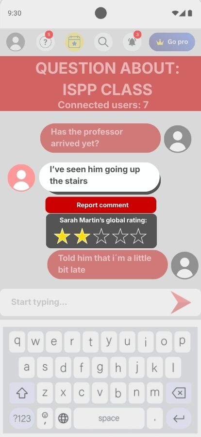

## **US-41: Highlight event with budget**

## **US-42: User management**
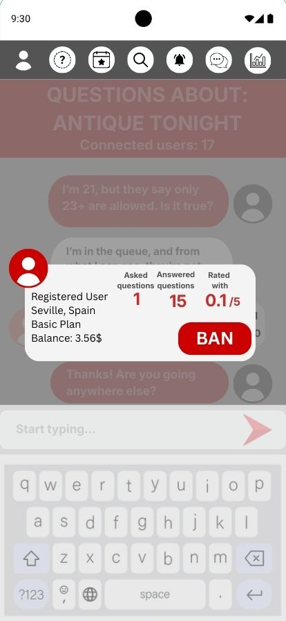
### Desirable Stories Post-MVP - Could Have

## **US-43: Personal calendar**
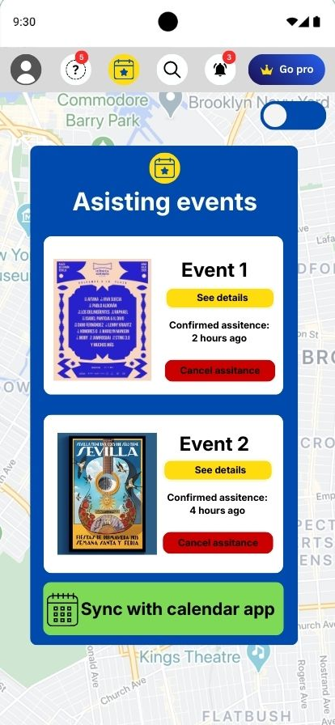

## **US-44: Recurring events**
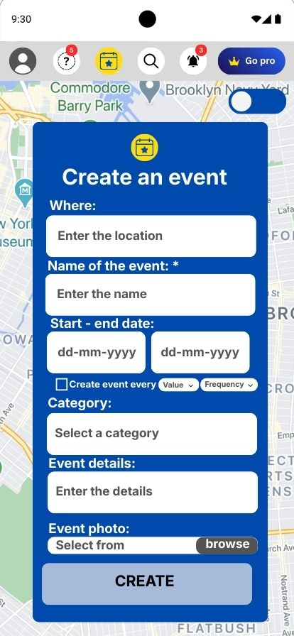

## **US-45: Business dashboard**

