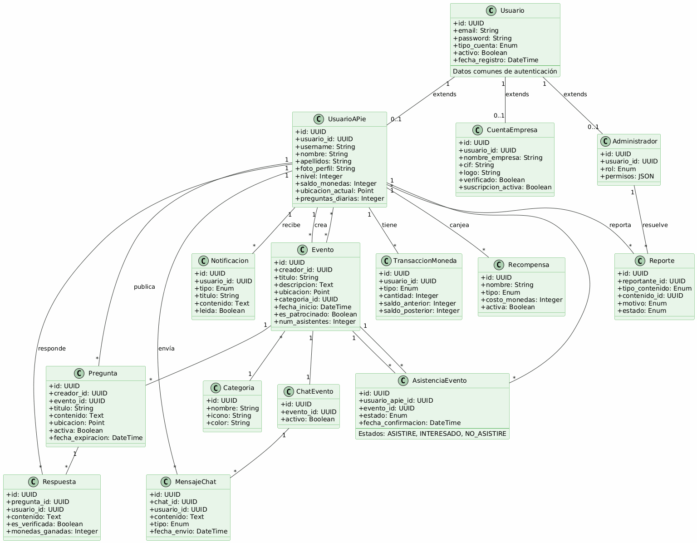

# Diagrama UML - Modelo de Datos

## Diagrama de clases UML

## Descripción del diagrama

### Entidades principales

**Usuarios y Roles (Herencia)**
- **Usuario**: Entidad base con datos de autenticación (email, password, tipo de cuenta)
- **UsuarioAPie**: Usuario regular de la aplicación (hereda de Usuario). Incluye perfil, ubicación, gamificación
- **CuentaEmpresa**: Organizaciones verificadas (hereda de Usuario). Puede crear eventos patrocinados
- **Administrador**: Gestores del sistema (hereda de Usuario). Puede moderar contenido

**Sistema de Eventos**
- **Evento**: Actividades geolocalizadas con categorías
- **Categoria**: Clasificación de eventos (música, deportes, cultura, etc.)
- **AsistenciaEvento**: Tabla de relación N:M entre UsuarioAPie y Evento. Gestiona quién asiste, está interesado o no asistirá. Cada usuario puede tener un solo estado por evento

**Sistema de Preguntas**
- **Pregunta**: Consultas geolocalizadas sobre eventos o lugares
- **Respuesta**: Respuestas de usuarios con sistema de verificación

**Comunicación**
- **ChatEvento**: Chat grupal por evento
- **MensajeChat**: Mensajes individuales del chat
- **Notificacion**: Alertas para usuarios

**Gamificación**
- **TransaccionMoneda**: Historial de monedas virtuales
- **Recompensa**: Premios canjeables con monedas

**Moderación**
- **Reporte**: Sistema de denuncias de contenido

### Cardinalidades

- `1` : Relación uno a uno
- `*` : Relación uno a muchos
- `0..1` : Relación opcional

### Relaciones Clave

- **Herencia**: Usuario es la clase padre de UsuarioAPie, CuentaEmpresa y Administrador
- **UsuarioAPie** puede crear múltiples eventos, preguntas y respuestas
- **Asistencia**: La tabla AsistenciaEvento gestiona la relación N:M entre usuarios y eventos con estados (ASISTIRE, INTERESADO, NO_ASISTIRE)
- Los eventos tienen chat asociado (1:1) y múltiples asistentes (N:M)
- Las preguntas pueden estar vinculadas opcionalmente a eventos
- El sistema de monedas registra todas las transacciones de UsuarioAPie
- Los administradores gestionan reportes y verificaciones
